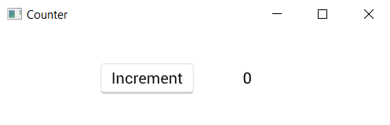

<div align="center"><h1>Vizia</h1></div>

<div align="center">
  <!-- License -->
  <a href="https://github.com/vizia/vizia/blob/main/LICENSE">
    
  </a>
  <!-- CI -->
  <a href="https://github.com/vizia/vizia/actions/workflows/build.ym">
    
  </a>
  <!-- docs (TODO) -->
  <!-- Audit -->
  <a href="https://github.com/vizia/vizia/actions/workflows/audit.yml">
    
  </a>
  <!-- Discord -->
  <a href="https://discord.gg/aNkTPsRm2w">
    
  </a>
</div>

<!-- [](https://crates.io/crates/vizia) -->
<!-- [](https://docs.rs/vizia/) -->

<br/>

Vizia is a declarative GUI framework for the Rust programming language.

> **WARNING** - Vizia is currently experimental and **not** considered stable.

## At a Glance
A simple counter application. Run with `cargo run --example counter`.
```rust
#[derive(Lens)]
pub struct AppData {
    count: i32,
}

pub enum AppEvent {
    Increment,
}

impl Model for AppData {
    fn event(&mut self, _: &mut Context, event: &mut Event) {
        event.map(|app_event| match app_event {
            AppEvent::Increment => {
                self.count += 1;
            }
        });
    }
}

Application::new(|cx| {
    AppData { count: 0 }.build(cx);

    HStack::new(cx, |cx| {
        Button::new(cx, 
            |cx| cx.emit(AppEvent::Increment), 
            |cx| Label::new(cx, "Increment"));
        Label::new(cx, AppData::count)
            .width(Pixels(50.0));
    })
    .child_space(Stretch(1.0))
    .col_between(Pixels(50.0));
})
.title("Counter")
.inner_size((400, 100))
.run();
```
<div align="center"></div>

---


## Features
 - Multiplatform (Windows, Linux, MacOS, Web)
 - Declarative API
 - Reactive data system (elm-like)
 - Flexible layout engine, powered by [morphorm](https://github.com/vizia/morphorm)
 - CSS styling with hot reloading
 - Style property animations
 - Audio plugin GUI development

## Learning Vizia
<!-- Add docs to this when ready -->
<div align="center">
  <h3>
    <a href="https://book.vizia.dev/"> Getting Started </a>
    <span> | </span>
    <a href="https://book.vizia.dev/"> The Book </a>
    <span> | </span>
    <a href="https://demo.vizia.dev/"> Web Demo </a>
  </h3>
</div>


## Example Projects

// Example projects go here... with pictures and stuff...

Vizia is also being used for the [Meadowlark project](https://github.com/MeadowlarkDAW/Meadowlark), an upcoming modern Digital Audio Workstation (DAW) built with Rust.

## Architecture
Vizia's core abstraction is a tree of **entities**. Each entity is just an integer, but this integer keys a number of dictionaries affecting how the entities look and act:
- **Style properties**, directives for layout and drawing
- **Models**, custom user-stored data which store a list of observers
- **Views**, bundles of callback logic to handle custom drawing, data reactivity, and user interaction

In order to interact with this tree of entities, there are several tools. The important ones are:
- **Bindings**, special views which watch for data changes and refresh their children
- **Events**, messages that propagate up or down the tree and trigger callbacks

To learn more, read [the book](https://book.vizia.dev/), check out [the examples](https://github.com/vizia/vizia/tree/main/examples), or join [our discord](https://discord.gg/aNkTPsRm2w)!

## Contributing

// TODO

For help with vizia, or to get involved with contributing to the project, come join us on [our discord](https://discord.gg/aNkTPsRm2w).

## License and Attribution
Vizia is licensed under [MIT](https://github.com/vizia/vizia/blob/main/LICENSE).

Fonts used in Vizia:
- Roboto licensed under [Apache license](http://www.apache.org/licenses/LICENSE-2.0).
- Open Sans Emoji licensed under [Apache license](http://www.apache.org/licenses/LICENSE-2.0).
- Amiri licensed under [Open Font License](https://scripts.sil.org/cms/scripts/page.php?site_id=nrsi&id=OFL).
- Entypo licensed under CC BY-SA 4.0.
- Material Icons licensed under [Apache license](https://github.com/google/material-design-icons/blob/master/LICENSE).


Vizia logo designed by [Lunae Somnia](https://github.com/LunaeSomnia).
